# COMET Image Processing and Analysis

A workflow for extracting single-cell protein expression data from multiplexed immunofluorescent brain images, enabling high-dimensional analysis of microglial phenotypes.

## Why This Workflow?

### The Problem

Multiplexed imaging platforms like COMET can simultaneously visualize 10+ protein markers in a single tissue section. However, most commercial analysis software (e.g., Visiopharm) is expensive, requires training, and may not be optimized for specific cell types like microglia.

### The Solution

This workflow provides a **free, reproducible alternative** using:
- **ImageJ/FIJI** - Free, open-source image analysis software
- **Python** - For data processing and formatting
- **CAFE** - Cluster Analysis for Flow-like Expression data (our analysis pipeline)

The result: You can go from raw multiplexed images to publication-ready single-cell analyses without specialized commercial software.

---

## What is Multiplexed Imaging?

Traditional immunofluorescence limits you to ~4 markers per tissue section due to spectral overlap. **Multiplexed imaging platforms** overcome this by using:
- Sequential antibody staining and stripping cycles
- Spectral unmixing
- Mass-tagged antibodies

**COMET (Codex by Akoya)** is one such platform that can image 40+ markers on a single tissue section, capturing the complexity of cellular phenotypes.

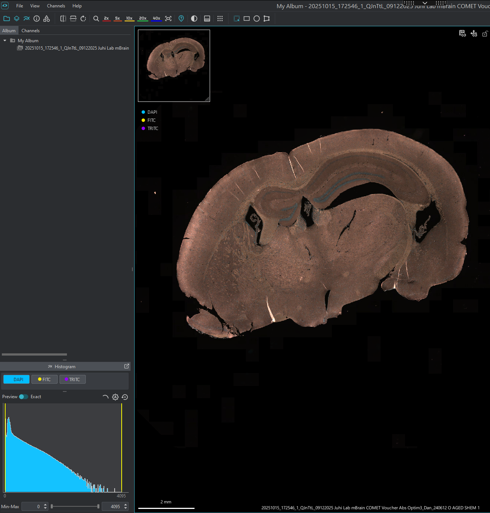
*A mouse brain section viewed in COMET software (Horizon Viewer) showing the DAPI channel, which labels all cell nuclei.*

---

## What Are We Measuring?

### Microglia: The Brain's Immune Cells

Microglia are the resident immune cells of the brain. They:
- Survey the brain for damage or infection
- Clear cellular debris
- Regulate inflammation
- Play roles in neurodegenerative diseases

**Microglial phenotypes are heterogeneous** - they can exist in many functional states depending on their environment. By measuring multiple protein markers simultaneously, we can characterize these different states.

### From Images to Single-Cell Data

The goal of this workflow is to convert image data into a **single-cell expression matrix**:

| Cell ID | Iba1 | APOE | CD68 | CD206 | Arg1 | ... |
|---------|------|------|------|-------|------|-----|
| Cell_001 | 245 | 89 | 156 | 45 | 78 | ... |
| Cell_002 | 312 | 234 | 67 | 189 | 45 | ... |
| ... | ... | ... | ... | ... | ... | ... |

Each row is a single cell. Each column is the mean fluorescence intensity (MFI) for a protein marker within that cell's boundaries. This format enables powerful downstream analyses like clustering, dimensionality reduction, and differential expression.

---

## Workflow Overview

```
┌─────────────────────────────────────────────────────────────────────────┐
│                         COMET ANALYSIS WORKFLOW                          │
├─────────────────────────────────────────────────────────────────────────┤
│                                                                          │
│  1. COMET Software          2. Python Script         3. ImageJ/FIJI     │
│  ┌──────────────┐          ┌──────────────┐         ┌──────────────┐    │
│  │ Background   │          │ Split multi- │         │ Segment      │    │
│  │ subtraction  │ ───────► │ channel TIFF │ ──────► │ microglia    │    │
│  │ + ROI export │          │ into singles │         │ using Iba1   │    │
│  └──────────────┘          └──────────────┘         └──────────────┘    │
│                                                            │             │
│                                                            ▼             │
│  5. CAFE Pipeline          4. ImageJ Measure         ROI Manager        │
│  ┌──────────────┐          ┌──────────────┐         ┌──────────────┐    │
│  │ Clustering,  │          │ Measure MFI  │         │ Apply ROIs   │    │
│  │ UMAP, etc.   │ ◄─────── │ per cell per │ ◄────── │ to all       │    │
│  │              │          │ marker       │         │ channels     │    │
│  └──────────────┘          └──────────────┘         └──────────────┘    │
│                                                                          │
└─────────────────────────────────────────────────────────────────────────┘
```

---

## Detailed Steps

### Step 1: Pre-processing in COMET Software (Horizon Viewer)

Raw COMET images are enormous (often >100GB). Before analysis, we need to:
1. Open the image in COMET's Horizon Viewer software
2. Apply background subtraction to remove autofluorescence
3. Crop to the region of interest and downscale the bit depth
4. Export only the channels we need

#### 1a. Open Your Image

Open your image of interest in the COMET Horizon Viewer software. The viewer displays your brain section along with a channel list and histogram panel.


*A mouse brain section viewed in COMET Horizon Viewer showing the DAPI channel, which labels all cell nuclei.*

#### 1b. Background Subtraction

Background subtraction removes non-specific signal (autofluorescence) that can obscure true marker expression.

**Open the Background Subtraction dialog** via `Channels > Background Subtraction`:

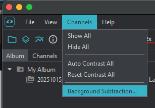
*Access background subtraction from the Channels menu*

**Configure the subtraction settings.** The dialog allows batch or single selection of channels. Set each original marker channel to be subtracted against its appropriate background control channel (e.g., FITC, TRITC, Cy5, or Cy7 defaults). Click "Add all" to populate the channel list automatically:

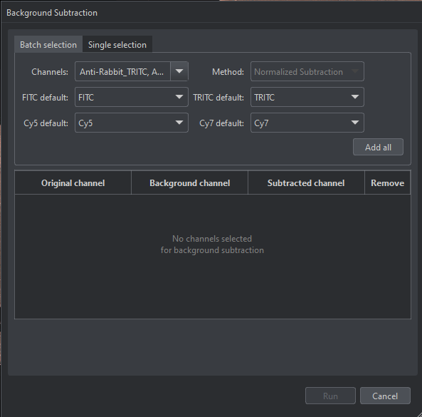
*The Background Subtraction dialog before channels are added*

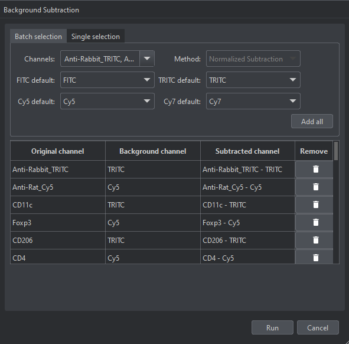
*After clicking "Add all", each marker channel is paired with its background control channel using Normalized Subtraction*

**Run the background subtraction.** Click "Run" to start processing. A progress bar will show the status:

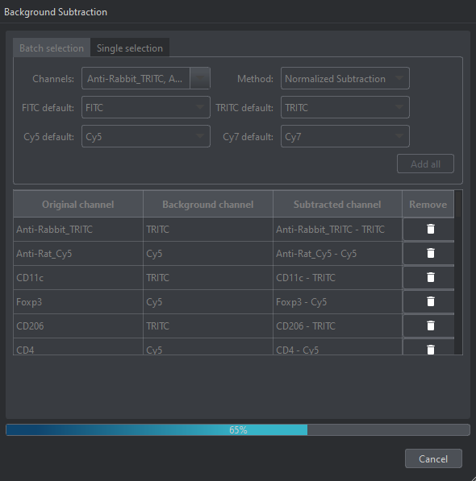
*Background subtraction in progress (65%)*

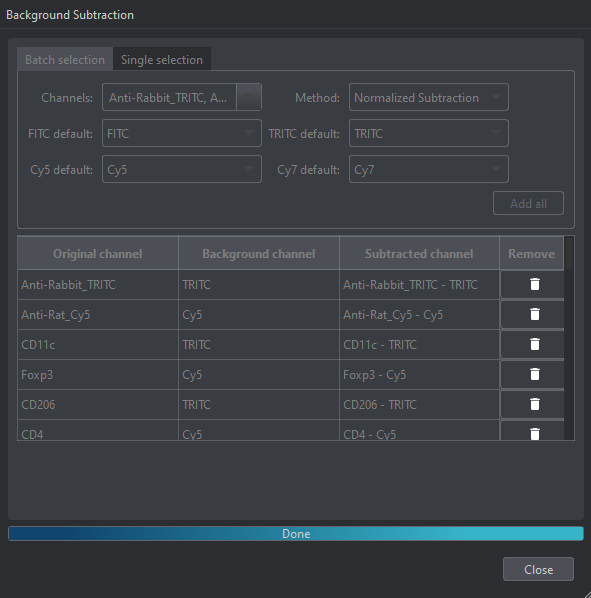
*Background subtraction complete - click "Close" to continue*

#### 1c. Verify Background-Subtracted Channels

After processing, the background-subtracted channels appear in the channel list on the left side of the viewer, listed below the original channels under "Subtracted channels":

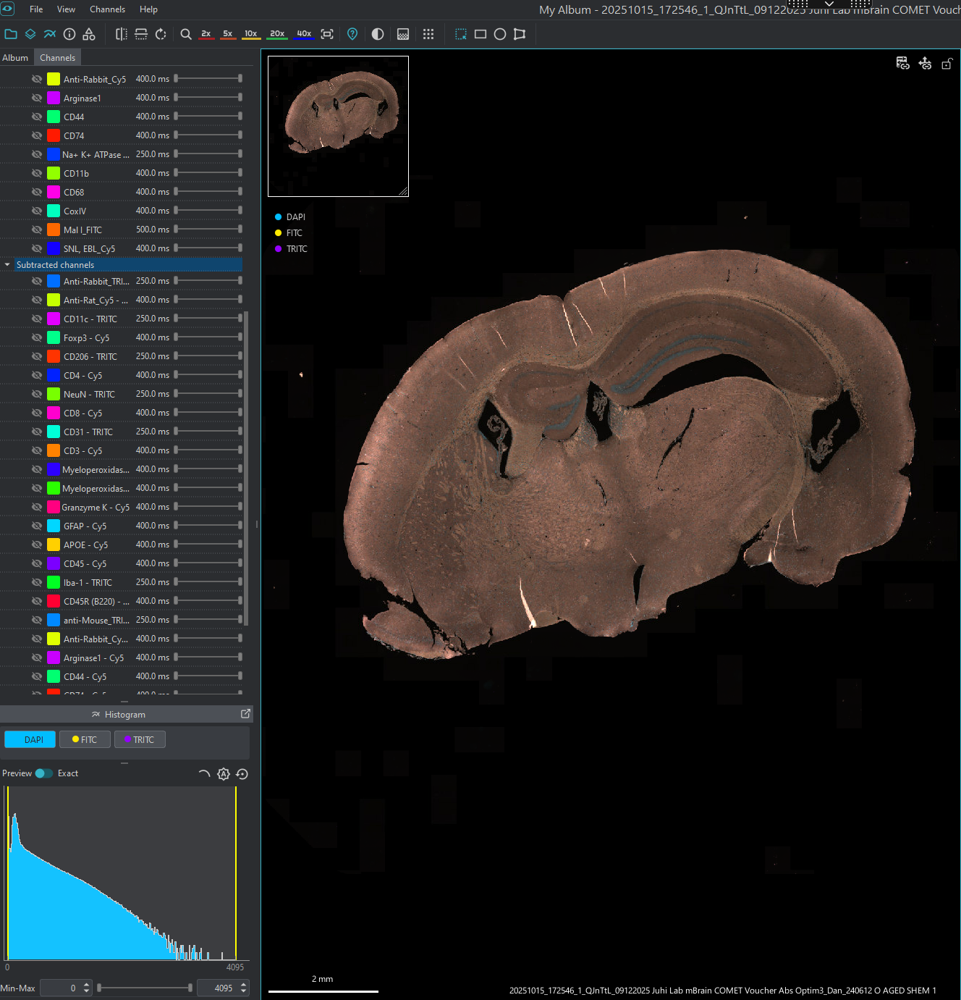
*The channel panel now shows both original channels (top) and the newly created background-subtracted channels (bottom)*

#### 1d. Draw a Region of Interest

Full brain sections are too large to process efficiently. Use the rectangle annotation tool to draw a selection around the tissue region you want to analyze:

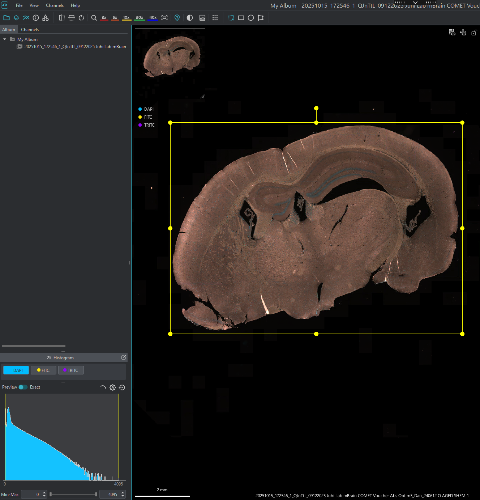
*Draw a rectangle around the tissue of interest. This will be used to crop the export.*

#### 1e. Export as OME-TIFF

Export the cropped, background-subtracted image via `File > Export OME-TIFF`:

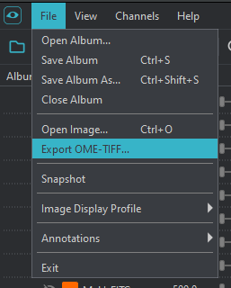
*Navigate to File > Export OME-TIFF*

**Configure export settings.** There are several important options to set:

**Compression method:** Select **Lzw** compression to reduce file size:

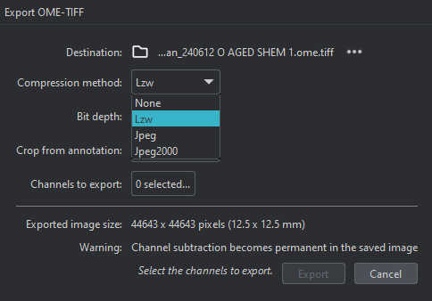
*Choose Lzw compression*

**Bit depth:** Downscale from 12-bit to **8-bit** to further reduce file size:

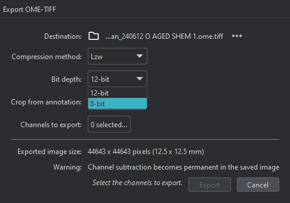
*Select 8-bit depth - this significantly reduces file size with minimal impact on downstream analysis*

**Crop from annotation:** Select **Rectangle** to crop the export to the region of interest you drew:

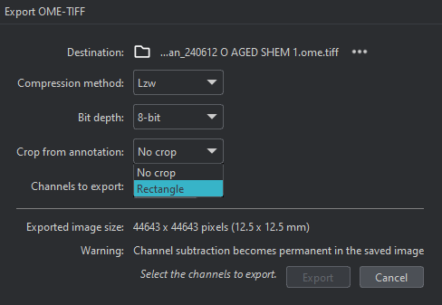
*Select "Rectangle" to crop to your annotation*

**Channels to export:** Select **DAPI** and all **background-subtracted channels**. In this example, 24 channels are selected. Notice the exported image size is now 37341 x 26989 pixels (10.46 x 7.56 mm), smaller than the full 44643 x 44643 pixel image:

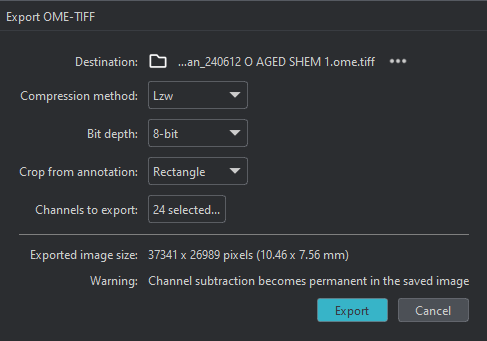
*Final export configuration: Lzw compression, 8-bit depth, cropped to rectangle, 24 channels selected*

Click **Export** to begin. The export progress is shown at the bottom of the dialog:

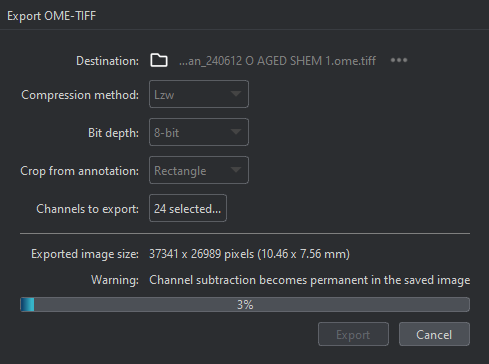
*Export in progress (3%)*

#### 1f. Verify Exported File Size

The cropping, channel selection, and bit-depth downscaling dramatically reduce the file size. In this example, the raw uncropped image was 171GB, but the exported cropped and downscaled OME-TIFF is only **6.59GB**:

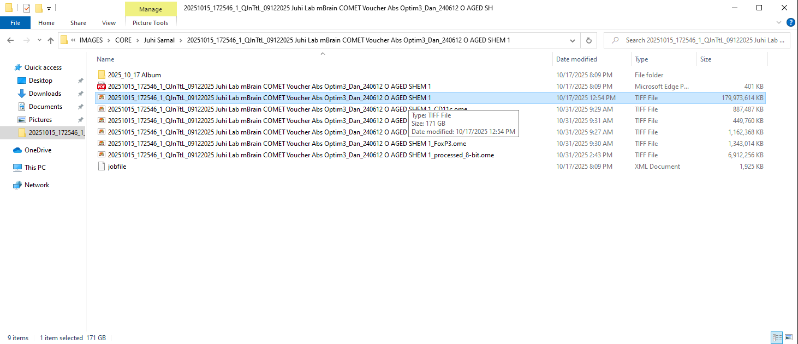
*The raw COMET image files - the full image is 171GB*

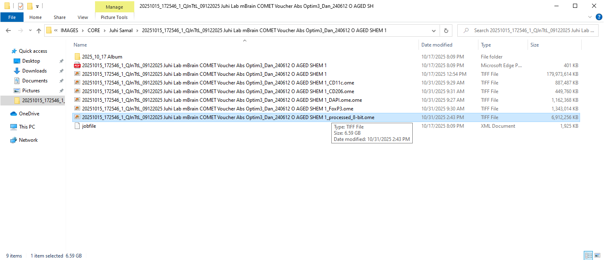
*After cropping and downscaling to 8-bit, the exported OME-TIFF is only 6.59GB - a ~26x reduction in file size*

---

### Step 2: Split Multi-Channel TIFF

COMET exports a single OME-TIFF containing all channels. ImageJ works better with individual channel files.

Use `split_ometiff_channels.py`:

```bash
# Install dependencies
pip install tifffile imagecodecs

# Split channels
python split_ometiff_channels.py <input.ome.tiff> <output_directory> <prefix>
```

This creates separate TIFF files for each channel:
- `prefix_DAPI.tif`
- `prefix_Iba1.tif`
- `prefix_APOE.tif`
- etc.

---

### Step 3: Microglial Segmentation in ImageJ

The key insight: **Use Iba1 (a microglial marker) to create cell boundaries, then apply those boundaries to measure all other markers.**

#### 3a. Open and Adjust Iba1 Channel

1. Open the Iba1 channel image in ImageJ
2. Adjust Brightness/Contrast (Image > Adjust > Brightness/Contrast)
3. Make the image **slightly oversaturated** to ensure all microglia are visible
4. Click "Apply" to permanently adjust the values

| Before B/C Adjustment | After B/C Adjustment |
|----------------------|---------------------|
| 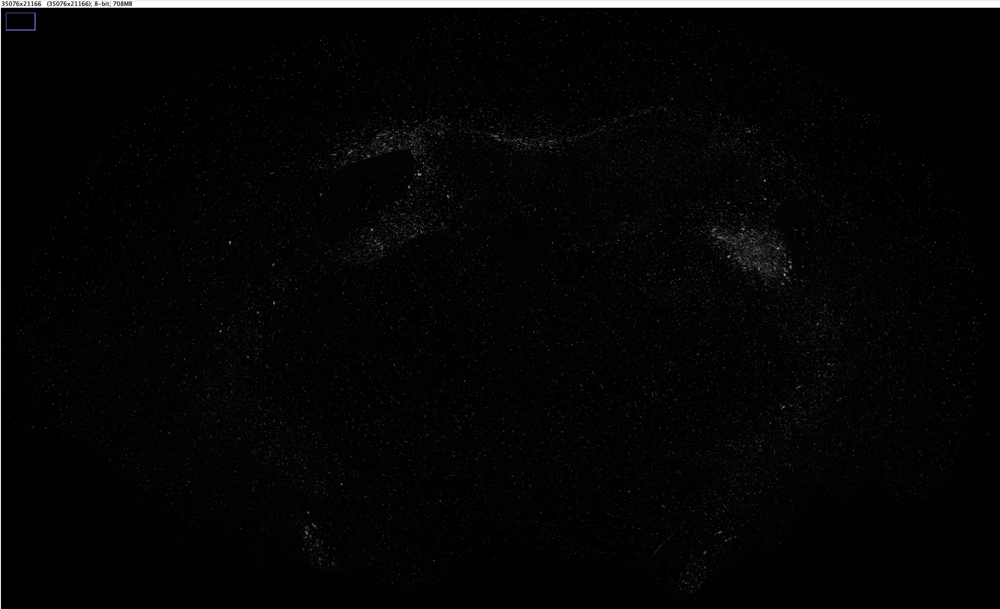 | 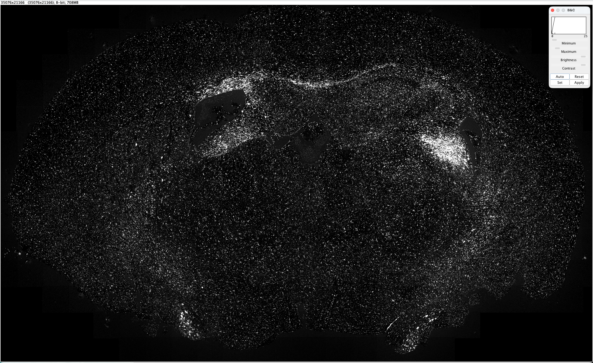 |

*The goal is to make all microglial cell bodies clearly visible, even if some bright cells become saturated*

#### 3b. Create Binary Mask

Convert the grayscale image to a binary (black/white) mask:

1. `Process > Binary > Make Binary`
2. `Process > Binary > Dilate` (repeat 2x) - expands cell boundaries slightly
3. `Process > Binary > Close` - fills small holes in cells

| After Make Binary | After Dilate x2 + Close |
|-------------------|------------------------|
| 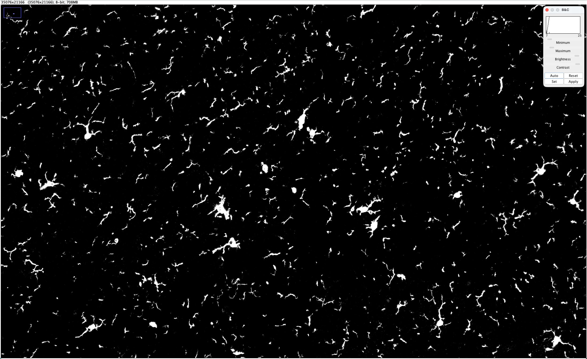 |  |

*The dilation step ensures we capture the full cell body and proximal processes*

#### 3c. Analyze Particles (Identify Individual Cells)

1. `Analyze > Analyze Particles`
2. Settings:
   - **Size: 1000-Infinity** pixels (excludes debris and partial cells)
   - Check **"Display results"**
   - Check **"Add to Manager"**

| After Analyze Particles | Zoomed Detail |
|------------------------|---------------|
| 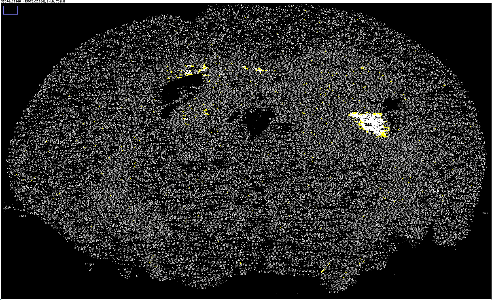 | 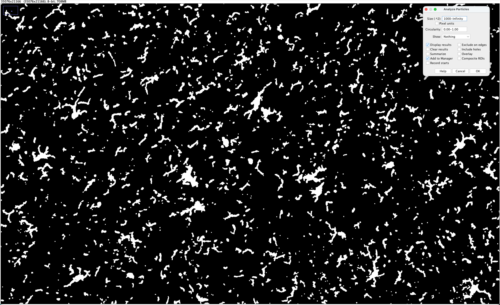 |

*Each colored region is a single identified microglial cell. The ROI Manager now contains the boundary of every cell.*

#### Full Brain View with All ROIs

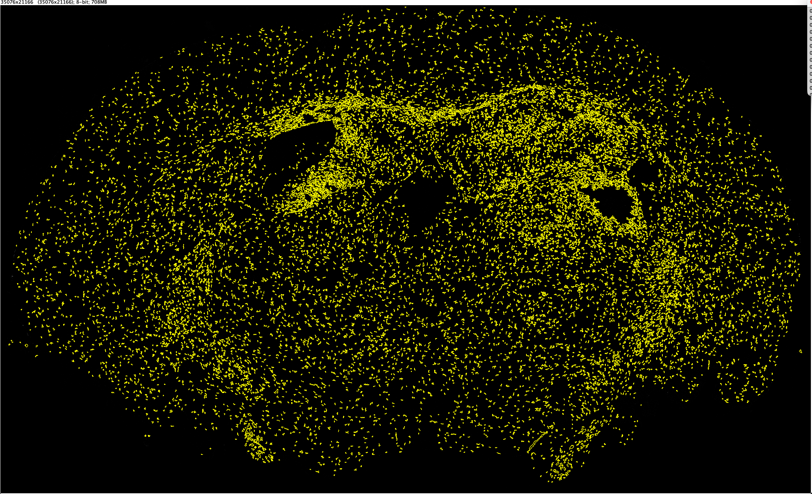
*All identified microglial cells (yellow) across the entire tissue section. Each dot represents one cell that will be measured.*

---

### Step 4: Measure Marker Expression

Now apply the Iba1-derived cell boundaries to measure other markers:

1. Open a phenotypic marker image (e.g., APOE, CD68, CD206)
2. **Do NOT adjust brightness/contrast** - we want raw intensity values
3. In ROI Manager: Select all ROIs (click first, then Shift+click last)
4. Click **"Measure"**

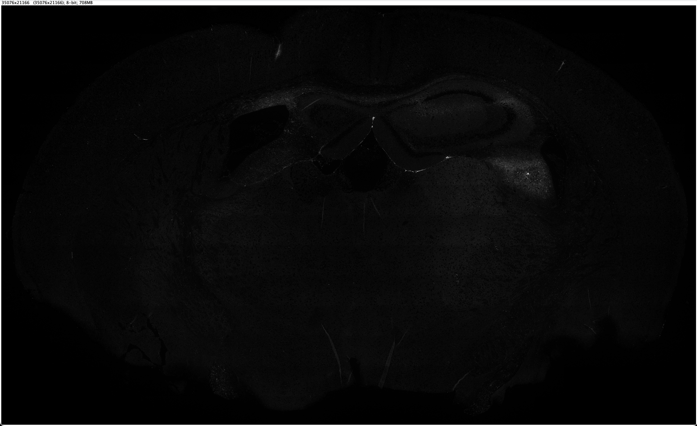
*APOE channel with Iba1-derived cell boundaries overlaid. The "Mean" measurement gives the average APOE intensity within each cell.*

The **Mean** value represents the Mean Fluorescence Intensity (MFI) for that marker in that cell.

Repeat for all markers of interest.

---

### Step 5: Data Export

Compile measurements into a CSV file:

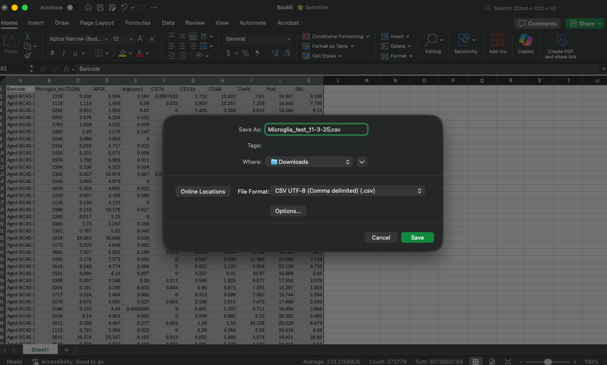
*Save your measurements as CSV for downstream analysis*

Format your data with:
- **Cell barcode**: Unique identifier (e.g., `SampleName_cell001`)
- **Sample metadata**: Group, condition, brain region, etc.
- **Marker values**: MFI for each marker

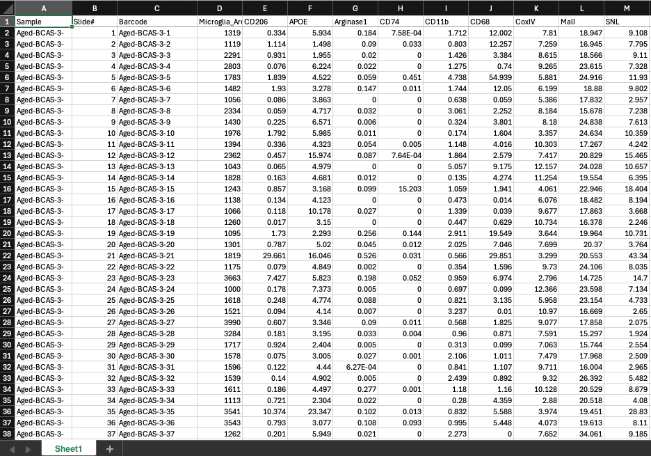
*Example data format ready for CAFE analysis*

---

### Step 6: Downstream Analysis with CAFE

Run the CAFE (Cluster Analysis for Flow-like Expression) pipeline on your single-cell data.

See `Young_Stroke_Sham_Microglia_Flow_for_CAFE.ipynb` for a complete example.

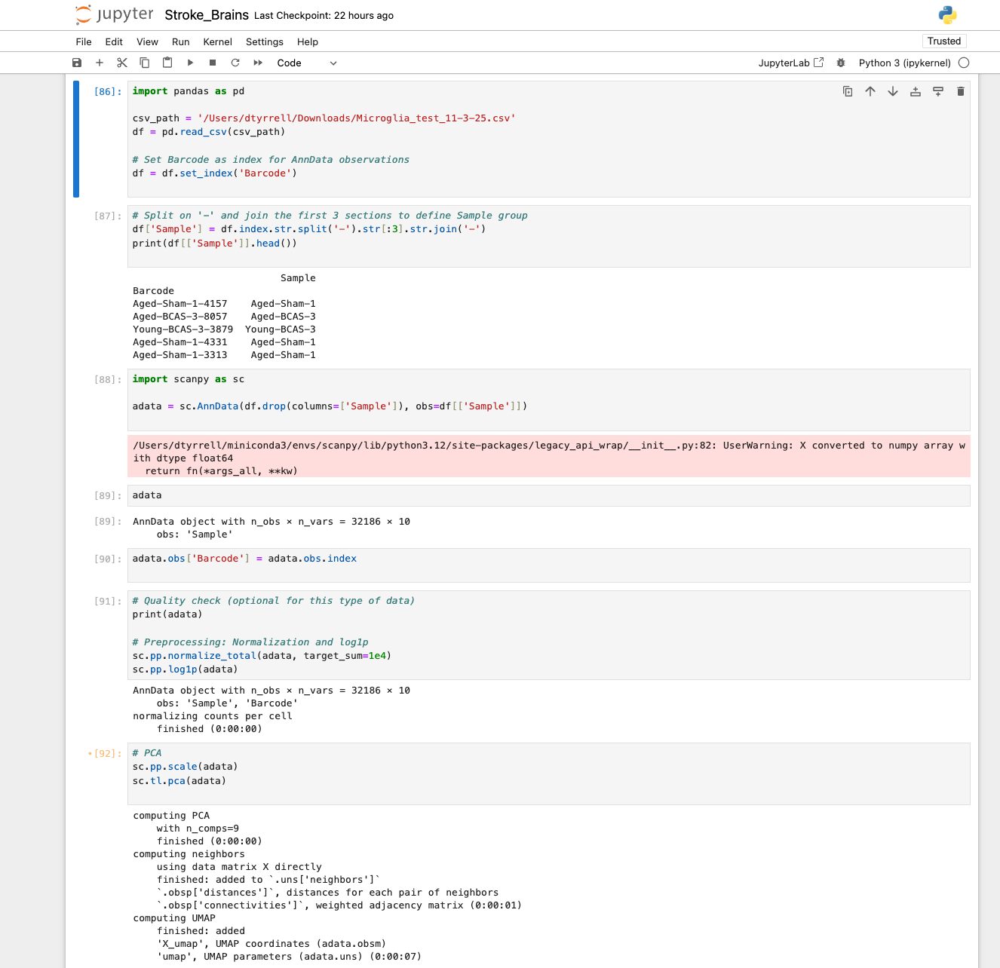
*The CAFE pipeline performs quality filtering, normalization, dimensionality reduction, and clustering*

#### Example Outputs

| UMAP by Sample | Spatial Marker Maps |
|---------------|---------------------|
| 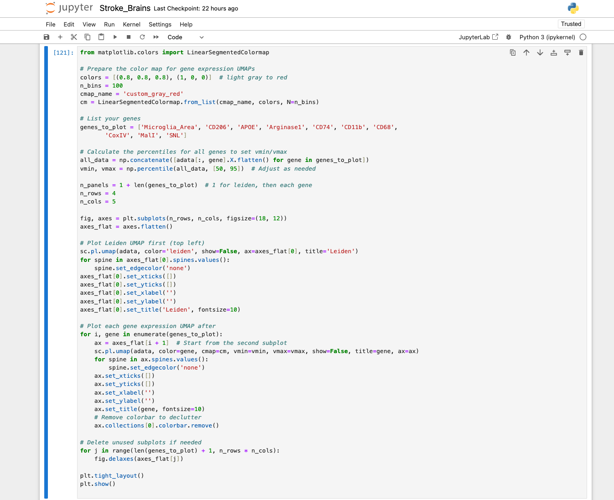 | 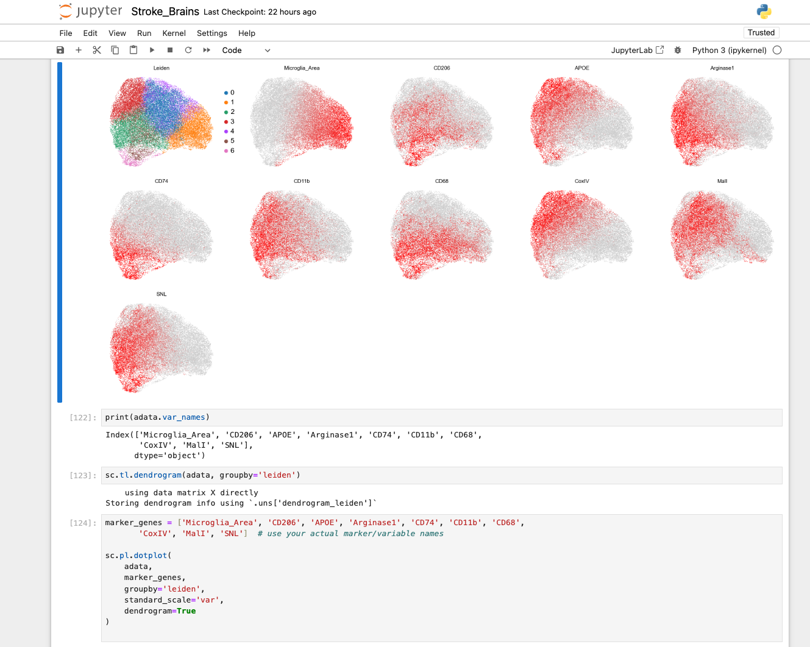 |

*Left: UMAP visualization showing microglial populations colored by experimental group. Right: Spatial maps showing marker expression patterns across the tissue.*

---

## Example Results: What You Can Discover

Using this workflow, we characterized microglial heterogeneity in aging and vascular dementia. The figure below (from [Ali et al., 2025](https://pmc.ncbi.nlm.nih.gov/articles/PMC12712942/)) demonstrates the type of analysis possible:

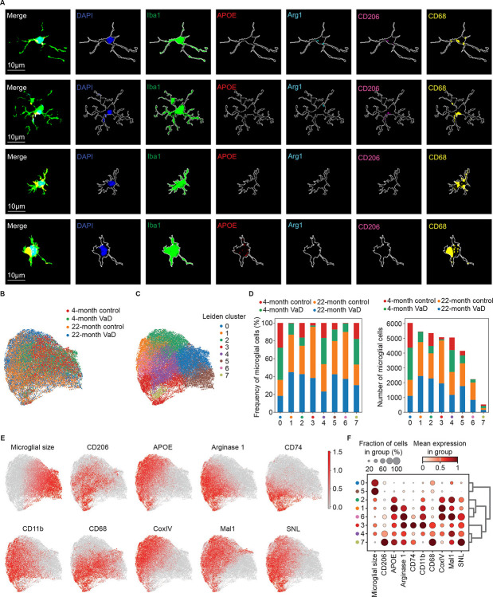

**Figure 4: Microglial Morphology is Heterogeneous in Aging and Vascular Dementia**

**(A)** Representative images of individual microglia showing diverse morphologies and marker expression patterns. Note how cells with extensive dendrites (ramified) show different protein expression than cells with larger soma and shorter processes (activated).

**(B-C)** UMAP visualization of ~20,000 microglia from 4 experimental groups, colored by condition (B) or Leiden cluster (C). Each point is a single cell positioned based on its protein expression profile.

**(D)** Cluster composition across experimental groups. Different microglial states (clusters) predominate in young vs. aged and control vs. disease conditions.

**(E)** Spatial feature plots showing how marker expression varies across the tissue. This preserves spatial context lost in standard flow cytometry.

**(F)** Dot plot heatmap showing marker expression patterns that define each cluster. Cluster 0 is characterized by high CD206 and Arg1 (anti-inflammatory), while Cluster 5 shows high APOE and CD68 (disease-associated).

> **Citation:** Ali MA, et al. High-Dimensional Single-Cell Analysis Reveals Coordinated Age-Dependent Neuroinflammatory Microglia-T cell Circuits in the Brain. *bioRxiv*. 2025 Dec 13. doi: 10.1101/2025.12.10.693494

---

## Additional Measurements

Using the saved ROIs, you can also calculate:

| Measurement | Method | Use Case |
|-------------|--------|----------|
| **Cell area** | Analyze > Measure | Cell size as activation indicator |
| **Branch number** | Skeletonize + Analyze Skeleton | Ramification state |
| **Branch length** | Skeletonize + Analyze Skeleton | Process extension |
| **Circularity** | Shape descriptors | Amoeboid vs ramified |

---

## Tips and Troubleshooting

### Size Filtering
- **Minimum 1000 pixels**: Excludes debris, partial cells, and non-specific staining
- **Maximum ~5000 pixels**: Considers excluding very large objects (often merged cells)

### Cell Traceability
- Cell barcodes allow you to trace back to specific cells in the original image
- Save your ROI files (`.zip` from ROI Manager) to revisit individual cells later

### Memory Management
- COMET images are large - ensure sufficient RAM (16GB+ recommended)
- Process one channel at a time if memory is limited
- Consider cropping to smaller regions for initial testing

### Quality Control
- Visually inspect segmentation on a subset of cells
- Check for over-segmentation (one cell split into many) or under-segmentation (merged cells)
- Adjust the size filter and B/C settings as needed for your tissue

---

## Files in This Repository

| File | Description |
|------|-------------|
| `split_ometiff_channels.py` | Python script to split multi-channel OME-TIFF into individual TIFFs |
| `Young_Stroke_Sham_Microglia_Flow_for_CAFE.ipynb` | Example Jupyter notebook for CAFE analysis |
| `Workflow for microglial imaging.docx` | Detailed text-based workflow documentation |
| `Microglial_COMET_Analysis_workflow.pptx` | Visual step-by-step guide with screenshots |
| `images/` | Workflow images extracted from the presentation |

---

## Requirements

### Software
- **COMET software** (or equivalent for your imaging platform)
- **ImageJ/FIJI**: [Download](https://imagej.net/software/fiji/)
- **Python 3.7+** with `tifffile` and `imagecodecs`
- **Jupyter** for running the analysis notebook

### Python Dependencies
```bash
pip install tifffile imagecodecs pandas numpy scanpy
```

---

## Questions or Issues?

This workflow was developed for analyzing COMET multiplexed imaging data from mouse brain tissue, but the principles apply to any multiplexed imaging platform and cell type.

For questions about the analysis approach, please refer to the methods in [Ali et al., 2025](https://pmc.ncbi.nlm.nih.gov/articles/PMC12712942/).
